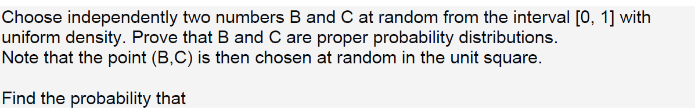

**(a) B + C < 1/2.**

**(b) BC < 1/2.**

**(c) |B - C| < 1/2.**

**(d) max{B,C} < 1/2.**

**(e) min{B,C} < 1/2.**

**_Prove that B and C are proper probability distributions_**

**_A:_** A probability distribution is a statistical function that describes all the possible values and likelihoods that a random variable can take within a given range. This range will be between the minimum and maximum statistically possible values. It can be shown using the following plot.


```{r,echo=T}
#number of observations
n <- 10000

#generate 10000X2 matrix of random numbers between 0 and 1. 
#matrix will contain 2 vectors bc[,1] = B and bc[,2] = C
bc <- matrix(runif(2*n, min=0, max=1), ncol=2)

#draw histogram of B to check skewness
hist(bc[,1], prob=TRUE, ylim=c(0,1.5), main = 'Histogram of B', xlab = '')

```


As bins of the histogram are evenly distributed, _B_ is proper probability distributions.

```{r,echo=T}
#draw histogram of C to check skewness
hist(bc[,2], prob=TRUE, ylim=c(0,1.5), main = 'Histogram of C', xlab = '')
```


As bins of the histogram are evenly distributed, _C_ is proper probability distributions.

**A: (a) B + C < 1/2.**

Using the information provided

_B_ and _C_ are random numbers from the interval _[0, 1]_.

$B = \{x|0\le x \le 1\}$ and $C = \{y|0\le y \le 1\}$

Both _B_ and _C_ can be interpreted as coordinates $(x,y)$ of a point chosen at random from the unit square.

We will be using _Monte Carlo procedure_  to find the probability of _B + C < 1/2_. Also, will be using a sample of 10000 observations to test the concept.

Let plot the area on a two-dimensional graph using 10000 observations. We are interested in finding the probability of selected coordinates, the sum of $x$ and $y$ is less than $1/2$, represented by the _green_ area in the graph.

```{r, echo=T}
#create a function to check if sum is less than 0.5
sumCoordinates <- function(x,y){return(x + y<0.5)}

#get true if sum of the coordinates is less than 0.5
outputbplusc <- sumCoordinates(bc[,1], bc[,2])

plot(x=bc[!outputbplusc,1], y=bc[!outputbplusc,2], xlab="x", ylab="y", col='blue', pch=20, xlim=c(0,1), ylim=c(0,1), asp=1)
points(bc[outputbplusc,1], bc[outputbplusc,2], col='green', pch=20)
```

Let event$(E)$ represent selection of coordinates$(x,y)$ and sum of the $x$ and $y$ being less than 0.5

$P(E) = \frac{Area\ of\ green\ triangle}{Area\ of\ entire\ square}$

Coordinates of entire square are $(0,0),(1,0),(1,1),(0,1)$, since this is unit square, let side of the square be $s$, area of the square = $s^2$

Coordinate of the green triangle from above figure are $(0,0), (0.5,0), (0,0.5)$

Note: Little less than $0.5$, for solving the problem lets assume $0.5$.

Height and base of the triangle is half of the side of the square, $h = \frac{s}{2}, b = \frac{s}{2}$. Area of the right triangle = $\frac{h*b}{2}$ = $\frac{\frac{s}{2}*\frac{s}{2}}{2}$ = $\frac{s^2}{8}$

$P(E) = \frac{Area\ of\ green\ triangle}{Area\ of\ entire\ square}$ = $\frac{\frac{s^2}{8}}{s^2}$ = $\frac{1}{8}$ = $`r 1/8`$

Hence mathematically, probability of sum of selected coordinates$(x,y)$ being less than $1/2$ is $`r 1/8`$

```{r, echo=T}
#for a sample of 10000 rows check number of coordinates sum is less than 0.5
#since output holds true or false values, it returns only true values
positives <- length(bc[outputbplusc,1])

#probability
prob <- positives/n
```

For a sample of 10000 observations, the probability of the sum of selected coordinates$(x,y)$ being less than $1/2$ is $`r prob`$.

**(b) BC < 1/2**

```{r, echo=T}
#create a function to check if sum is less than 0.5
prodCoordinates <- function(x,y){return((x * y)<0.5)}

#get true if sum of the coordinates is less than 0.5
outputbtimesc <- prodCoordinates(bc[,1], bc[,2])

plot(x=bc[!outputbtimesc,1], y=bc[!outputbtimesc,2], xlab="x", ylab="y", col='blue', pch=20, xlim=c(0,1), ylim=c(0,1), asp=1)
points(bc[outputbtimesc,1], bc[outputbtimesc,2], col='green', pch=20)
```

Let event$(E)$ represent selection of coordinates$(x,y)$ and product of the $x$ and $y$ being less than 0.5

$P(E) = \frac{Area\ of\ entire\ square\ -\ Area\ of\ blue\ sector}{Area\ of\ entire\ square}$

Coordinates of entire square are $(0,0),(1,0),(1,1),(0,1)$, since this is unit square, let side of the square be $s$, area of the square = $s^2$

Area of blue sector = $\bigg(\frac{\theta^0}{2}\bigg)\bigg(\frac{\pi}{180^0}\bigg)r^2$

Angle of the sector $\theta^0 = 90^0$, radius $r$ = side of the square $\frac{s}{2}$ = $0.5$ and $\pi = 3.1416$

Area of blue sector = $\bigg(\frac{90^0}{2}\bigg)\bigg(\frac{\pi}{180^0}\bigg)\bigg(\frac{s}{2}\bigg)^2$ = $\bigg(\frac{\pi}{4}\bigg)\bigg(\frac{s}{2}\bigg)^2$ = $\bigg(\frac{\pi s^2}{16}\bigg)$

Substituting values,

$P(E) = \frac{s^2 -\bigg(\frac{\pi s^2}{16}\bigg)}{s^2}$ = $\frac{16 - \pi}{16}$ = $`r (16 - 3.1416)/16`$

Hence mathematically, probability of product of selected coordinates$(x,y)$ being less than $1/2$ is $`r (16 - 3.1416)/16`$

```{r, echo=T}
#for a sample of 10000 rows check number of coordinates sum is less than 0.5
#since output holds true or false values, it returns only true values
positives <- length(bc[outputbtimesc,1])

#probability
prob <- positives/n
```

For a sample of 10000 observations, the probability of product of selected coordinates$(x,y)$ being less than $1/2$ is $`r prob`$.

**(c) |B - C| < 1/2**

```{r, echo=T}
#create a function to check if sum is less than 0.5
diffCoordinates <- function(x,y){return(abs(x - y)<0.5)}

#get true if sum of the coordinates is less than 0.5
outputabsbminusc <- diffCoordinates(bc[,1], bc[,2])

plot(x=bc[!outputabsbminusc,1], y=bc[!outputabsbminusc,2], xlab="x", ylab="y", col='blue', pch=20, xlim=c(0,1), ylim=c(0,1), asp=1)
points(bc[outputabsbminusc,1], bc[outputabsbminusc,2], col='green', pch=20)
```

Let event$(E)$ represent selection of coordinates$(x,y)$ and absolute difference between $x$ and $y$ being less than 0.5

$P(E) = \frac{Area\ of\ entire\ square\ - 2(Area\ of\ blue\ triangle)}{Area\ of\ entire\ square}$

Coordinates of entire square are $(0,0),(1,0),(1,1),(0,1)$, since this is unit square, let side of the square be $s$, area of the square = $s^2$

Height and base of the triangle is half of the side of the square, $h = \frac{s}{2}, b = \frac{s}{2}$. Area of the right triangle = $\frac{h*b}{2}$ = $\frac{\frac{s}{2}*\frac{s}{2}}{2}$ = $\frac{s^2}{8}$

$P(E) = \frac{s^2 - 2\bigg(\frac{s^2}{8}\bigg)}{s^2}$ = $\frac{8-2}{8}$ = $`r 6/8`$

Hence mathematically, probability of absolute difference of selected coordinates$(x,y)$ being less than $1/2$ is $`r 6/8`$

```{r, echo=T}
#for a sample of 10000 rows check number of coordinates sum is less than 0.5
#since output holds true or false values, it returns only true values
positives <- length(bc[outputabsbminusc,1])

#probability
prob <- positives/n
```
For a sample of 10000 observations, the probability of an absolute difference of selected coordinates$(x,y)$ being less than $1/2$ is $`r prob`$.


**(d) max{B,C} < 1/2**

```{r, echo=T}
#create a function to check if sum is less than 0.5
maxCoordinates <- function(x,y){return(max(x, y)<0.5)}

outputmaxbc <- rep(TRUE, n)
#get true if sum of the coordinates is less than 0.5
for (i in 1:n){
  outputmaxbc[i] <- maxCoordinates(bc[i,1], bc[i,2])
}


plot(x=bc[!outputmaxbc,1], y=bc[!outputmaxbc,2], xlab="x", ylab="y", col='blue', pch=20, xlim=c(0,1), ylim=c(0,1), asp=1)
points(bc[outputmaxbc,1], bc[outputmaxbc,2], col='green', pch=20)
```

Let event$(E)$ represent selection of coordinates$(x,y)$ and maximum coordinate between $x$ and $y$ being less than 0.5

$P(E) = \frac{Area\ of\ green\ square}{Area\ of\ entire\ square}$

Coordinates of entire square are $(0,0),(1,0),(1,1),(0,1)$, since this is unit square, let side of the square be $s$, area of the square = $s^2$

side of the green square is half of the side of the entire square, $gs = \frac{s}{2}$. Area of the green square = $gs^2$ = $\bigg(\frac{s}{2}\bigg)^2$ = $\frac{s^2}{4}$

$P(E) = \frac{\frac{s^2}{4}}{s^2}$ = $\frac{1}{4}$ = $`r 1/4`$

Hence mathematically, probability of maximum coordinate between selected coordinates$(x,y)$ being less than $1/2$ is $`r 1/4`$

```{r, echo=T}
#for a sample of 10000 rows check number of coordinates sum is less than 0.5
#since output holds true or false values, it returns only true values
positives <- length(bc[outputmaxbc,1])

#probability
prob <- positives/n
```
For a sample of 10000 observations, the probability of maximum coordinate between selected coordinates$(x,y)$ being less than $1/2$ is $`r prob`$.

**(e) min{B,C} < 1/2**

```{r, echo=T}
#create a function to check if sum is less than 0.5
minCoordinates <- function(x,y){return(min(x, y)<0.5)}

outputminbc <- rep(TRUE, n)
#get true if sum of the coordinates is less than 0.5
for (i in 1:n){
  outputminbc[i] <- minCoordinates(bc[i,1], bc[i,2])
}


plot(x=bc[!outputminbc,1], y=bc[!outputminbc,2], xlab="x", ylab="y", col='blue', pch=20, xlim=c(0,1), ylim=c(0,1), asp=1)
points(bc[outputminbc,1], bc[outputminbc,2], col='green', pch=20)
```

Let event$(E)$ represent selection of coordinates$(x,y)$ and minimum coordinate between $x$ and $y$ being less than 0.5

$P(E) = \frac{Area\ of\ entire\ square - Area\ of\ blue\ square}{Area\ of\ entire\ square}$

Coordinates of entire square are $(0,0),(1,0),(1,1),(0,1)$, since this is unit square, let side of the square be $s$, area of the square = $s^2$

side of the blue square is half of the side of the entire square, $gs = \frac{s}{2}$. Area of the blue square = $bs^2$ = $\bigg(\frac{s}{2}\bigg)^2$ = $\frac{s^2}{4}$

$P(E) = \frac{s^2 - \bigg(\frac{s^2}{4}\bigg)}{s^2}$ = $4 - \bigg(\frac{1}{4}\bigg)$ = $`r 3/4`$

Hence mathematically, probability of minimum coordinate between selected coordinates$(x,y)$ being less than $1/2$ is $`r 3/4`$

```{r, echo=T}
#for a sample of 10000 rows check number of coordinates sum is less than 0.5
#since output holds true or false values, it returns only true values
positives <- length(bc[outputminbc,1])

#probability
prob <- positives/n
```
For a sample of 10000 observations, the probability of minimum coordinate between selected coordinates$(x,y)$ being less than $1/2$ is $`r prob`$.


```{r,echo=T}
par(mfrow=c(3,2))
hist(bc[outputbplusc,1],main = 'Histogram of B+C < 0.5', xlab = '')
hist(bc[outputbtimesc,1],main = 'Histogram of BC < 0.5', xlab = '')
hist(bc[outputabsbminusc,1],main = 'Histogram of |B-C| < 0.5', xlab = '')
hist(bc[outputmaxbc,1],main = 'Histogram of MAX(B,C) < 0.5', xlab = '')
hist(bc[outputminbc,1],main = 'Histogram of MIN(B,C) < 0.5', xlab = '')
```


References:

1. Introduction to Probability by Charles M. Grinstead and J. Laurie Snell
2. https://www.r-bloggers.com/probability-and-monte-carlo-methods/
3. http://www.onlinemathlearning.com/probability-area.html
4. http://www.investopedia.com/terms/p/probabilitydistribution.asp
